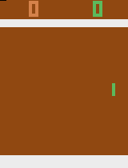
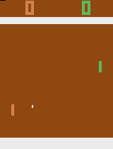

# Pong DQN

A DQN agent trained to play Atari Pong (`Pong-v4` / `ALE/Pong-v5`) from raw
pixels, using a stack of 4 preprocessed frames and a CNN Q-network (the
classic Mnih et al. Nature DQN architecture).

| | Random policy | Trained agent |
|---|---|---|
| |  |  |

## Files

| File | Purpose |
|---|---|
| [pong_dqn_frame_skips.ipynb](pong_dqn_frame_skips.ipynb) | **Training notebook.** Builds the environment, preprocessing, replay memory, Q-network, and training loop; trains the agent and writes TensorBoard logs. |
| [pong_dqn_inference.ipynb](pong_dqn_inference.ipynb) | **Evaluation notebook.** Loads the trained checkpoint and evaluates it under three conditions (deterministic baseline, sticky actions, random no-op starts), reports summary stats, and records the `pong_trained.gif` / `pong_trained.mp4` rollout. |
| `pong_random.gif` | Sample rollout of a random policy, for comparison. |
| `pong_trained.gif` / `pong_trained.mp4` | Sample rollout of the trained agent. |

## Setup

```bash
pip install gymnasium "gymnasium[atari,accept-rom-license]" ale-py opencv-python imageio torch matplotlib pandas tensorboard
```

Then launch Jupyter and open either notebook:

```bash
jupyter notebook
```

## Approach

- **Environment**: `Pong-v4` (training) / `ALE/Pong-v5` (evaluation), frameskip 4.
- **Preprocessing**: each frame is cropped to the playing field, resized to
  84x84, and converted to grayscale. The state fed to the network is a stack
  of the 4 most recent frames (channels), so the network can infer motion.
- **Network** (`QNetwork`): 3 conv layers (8x8/stride 4, 4x4/stride 2,
  3x3/stride 1) → FC 512 → FC to per-action Q-values.
- **Training**: standard DQN with a replay buffer, a target network with soft
  (Polyak) updates, epsilon-greedy exploration with exponential decay, and an
  MSE loss between current and target Q-values (`local_network` is trained,
  `target_network` tracks it).
- **Evaluation**: the inference notebook checks the trained policy isn't just
  memorizing a single deterministic trajectory — it re-evaluates under sticky
  actions (25% action-repeat) and randomized no-op starts (up to 30), which is
  the condition that gives genuinely independent episodes (effective n = 20),
  and plots/tabulates the score distributions across all three conditions.

## Running it

1. Open [pong_dqn_frame_skips.ipynb](pong_dqn_frame_skips.ipynb) and run all
   cells to train from scratch. This writes a checkpoint  and
   TensorBoard logs.

   ```bash
   tensorboard --logdir logs_pong_dqn_frame_skips
   ```

2. Open [pong_dqn_inference.ipynb](pong_dqn_inference.ipynb) and run all cells
   to evaluate on the checkpoint from part 1 across the three conditions above, and to regenerate
   `pong_trained.gif` / `pong_trained.mp4`.
